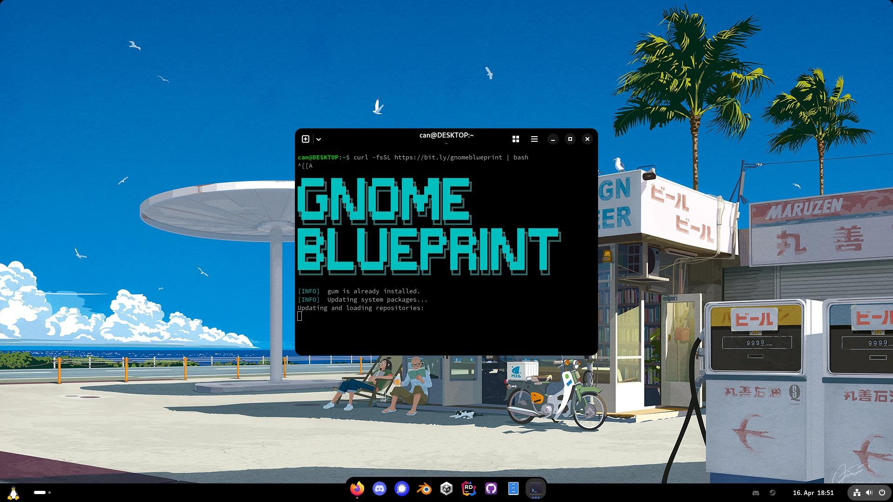
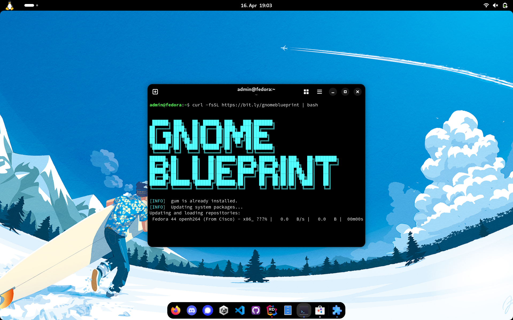

<h1 align="center" style="text-align:center">02Gnome</h1>
<h4 align="center" style="text-align:center">
Automate your GNOME desktop in one command.<br>Extensions, themes, apps, and settings. All configured interactively.
</h4>
<p align="center" style="text-align:center">
20 minutes is all it takes to go from zero to a custom Fedora environment using 02Gnome.
<br><em>
Works on Fedora Workstation and atomic variants (Silverblue, Bazzite), and other distros (Nobara, Ubuntu, Arch, etc.).
</em></p>

<p align="center" style="text-align:center">
  
  
  
  
  <a href="LICENSE"></a>
  <a href="https://deepwiki.com/CanTalat-Yakan/02Gnome"></a>
</p>

## Recommended Base Install

Download [**Fedora Workstation 44**](https://fedoraproject.org/workstation/download/) and flash it to a USB drive with [**Fedora Media Writer**](https://github.com/FedoraQt/MediaWriter).
A single tool that downloads the ISO and creates a bootable USB in a few clicks.

> For atomic/immutable variants, grab [Silverblue](https://fedoraproject.org/silverblue/download/) or [Bazzite](https://bazzite.gg/) instead.

## Quick Installation

```bash
curl -fsSL bit.ly/02gnome | bash
```


<!-- TOC -->

- [Quick Installation](#quick-installation)
- [Desktop Profile](#desktop-profile)
- [Laptop Profile](#laptop-profile)
- [Theming](#theming)
- [Bloat Removal](#bloat-removal)
- [What the Installer Does](#what-the-installer-does)
- [Essential Applications](#essential-applications-always-installed)
- [GNOME Shell Extensions](#gnome-shell-extensions-always-installed)
- [Optional Applications](#optional-applications-interactive-chooser)
- [Docker Compose Services](#docker-compose-services-interactive-chooser)
- [Atomic Fedora Support](#atomic--immutable-fedora-support)
- [Project Structure](#project-structure)
- [Customisation](#customisation)
- [License](#license)

## Desktop Profile

- Panel at **bottom**, clock on the **right**
- Notification banners in the **bottom-right** corner
- Dynamic workspaces
- Blank screen: never / no idle dim
- No touchpad natural scroll / tap-to-click
- `Super+D` show desktop, `Super+E` files, `Super+T` terminal, `Super+Space` ArcMenu runner



## Laptop Profile

- Panel at the **top**, clock in the **center**
- Dynamic workspaces
- Battery percentage shown, ambient brightness enabled
- Lid close → suspend (resumes instantly on open)
- Tap-to-click, natural scroll, two-finger scrolling
- Same keyboard shortcuts as Desktop



## Theming

- **adw-gtk3-dark** installed via dnf - makes GTK3 apps match GTK4 Adwaita
- Flatpak overrides applied for `gtk-4.0` and `gtk-3.0` theme access
- Custom **Rewaita** themes included (`themes/dark` and `themes/light`)
- Prompts for an **Oled** preference to apply pure-black styling to Rewaita, Firefox, Terminal, and Text Editor
- Automatically configures **Add Water** and injects `user.js` to theme and lock down Firefox (disabling AI/bloat)

## Bloat Removal

When confirmed, the installer removes these pre-installed apps (Flatpak + RPM with safety check):

> Boxes · Calendar · Camera · Characters · Clocks · Connections · Contacts · Extensions · Disk Usage Analyser · Document Scanner · Fedora Media Writer · Help · LibreOffice Calc/Impress/Writer · Maps · System Monitor · Tour · Weather

RPM removal runs a **dry-run first** - if removing a package would cascade into `gnome-shell`, `gdm`, or `mutter`, it is safely skipped.

## What the installer does

| Step | Description |
|---|---|
| 1 | Installs **gum** for a nice TUI experience |
| 2 | Runs **system update** (`dnf update` + `flatpak update`) |
| 3 | Asks you to pick a profile: **Desktop** or **Laptop** |
| 4 | Installs **git**, **Docker**, **Tailscale**, and **fastfetch**, and sets up **Flatpak + Flathub** |
| 5 | Imports **profile-specific dconf settings** and runs the profile setup script |
| 6 | Installs **essential Flatpak apps** and **GNOME Shell extensions** |
| 7 | Re-applies **dconf settings** after extensions are installed (extensions may reset defaults on first enable) |
| 8 | Sets up **Adwaita themes** and installs **Rewaita** custom themes |
| 9 | Asks for **Oled (pure-black) preference** and applies it to Rewaita, Firefox, Terminal, and Text Editor |
| 10 | Configures **Add Water** and **Firefox** (injects `user.js` for privacy, deploys `policies.json` for search engine & toolbar) |
| 11 | Lets you toggle **user preferences** (24h clock, auto-login, regional formats, etc.) |
| 12 | Configures **Nautilus, Templates, Terminal, and Text Editor** defaults |
| 13 | Optionally downloads a **wallpaper collection** from [dharmx/walls](https://github.com/dharmx/walls) (defaults to [m-26.jp](https://github.com/dharmx/walls/tree/main/m-26.jp) slideshow) |
| 14 | Optionally **removes GNOME bloat** (Boxes, Calendar, Camera, Clocks, Characters, Weather, LibreOffice, etc.) |
| 15 | Lets you pick **optional apps** (Discord, Steam, VS Code, OpenCode, etc.) |
| 16 | Lets you pick **Docker Compose services** (Immich, Ollama + Open WebUI, ZeroTier) |
| 17 | Creates **web app shortcuts** for installed Docker services and Tailscale |
| 18 | **Pins installed apps** to the dock (Firefox first, Files/Terminal/Software last) |
| 19 | Registers **OpenCode shortcut** (`Super+C`) if installed |
| 20 | **Resets the app grid** to a single flat alphabetical layout |
| 21 | Detects **NVIDIA GPU** and installs proprietary drivers (`akmod-nvidia`, CUDA, VA-API) |
| 22 | Runs **final system cleanup** (autoremove, old kernels, journal trim, Flatpak repair) |

## Essential Applications (always installed)

| Application | Flatpak ID | Description |
|---|---|---|
| Firefox | `firefox` (system package) | Web browser |
| Flatseal | `com.github.tchx84.Flatseal` | Manage Flatpak permissions |
| Extension Manager | `com.mattjakeman.ExtensionManager` | Browse & toggle GNOME extensions |
| Pins | `io.github.fabrialberio.pinapp` | Create custom app shortcuts |
| Add Water | `dev.qwery.AddWater` | Apply Adwaita theme to Firefox |
| Rewaita | `io.github.swordpuffin.rewaita` | Bring color to Adwaita |
| Mission Center | `io.missioncenter.MissionCenter` | System resource monitor |
| Web App Hub | `org.pvermeer.WebAppHub` | Manage web applications |
| GNOME Tweaks | `gnome-tweaks` (system package) | Advanced GNOME settings |
| fastfetch | `fastfetch` (system package) | System information tool |

## GNOME Shell Extensions (always installed)

| Extension | UUID |
|---|---|
| AppIndicator | `appindicatorsupport@rgcjonas.gmail.com` |
| ArcMenu | `arcmenu@arcmenu.com` |
| Clipboard History | `clipboard-history@alexsaveau.dev` |
| Dash to Dock | `dash-to-dock@micxgx.gmail.com` |
| Gtk4 Desktop Icons NG (DING) | `gtk4-ding@smedius.gitlab.com` |
| Just Perfection | `just-perfection-desktop@just-perfection` |
| Logo Menu | `logomenu@aryan_k` |
| Panel Corners | `panel-corners@aunetx` |
| PiP on top | `pip-on-top@rafostar.github.com` |
| Quick Settings Audio Panel | `quick-settings-audio-panel@rayzeq.github.io` |
| Restart To | `restartto@tiagoporsch.github.io` |
| Rounded Window Corners Reborn | `rounded-window-corners@fxgn` | *Installed but disabled by default* |
| User Themes | `user-theme@gnome-shell-extensions.gcampax.github.com` |
| Vitals | `Vitals@CoreCoding.com` | *Installed but disabled by default* |
| Wallpaper Slideshow | `azwallpaper@azwallpaper.gitlab.com` |

> Extensions that don't list the current GNOME Shell version are **automatically patched** via `metadata.json` so they load without waiting for an upstream update.

## Optional Applications (interactive chooser)

Pick any combination from the TUI menu:

| Category | Application | Source |
|---|---|---|
| Entertainment | Steam                                              | RPM (via RPM Fusion) |
| Entertainment | Discord, Signal, VLC                               | Flatpak |
| Creative | Blender, GIMP, Unity Hub                           | Flatpak |
| Utilities | VS Code, JetBrains Rider, GitHub Desktop, Trayscale | Flatpak |
| Developer | OpenCode (AI coding agent)                         | Script |
| Runtimes | .NET SDK & Runtimes (LTS + STS)                    | Script |

Installed optional apps are automatically **pinned to the dock**.

## Docker Compose Services (interactive chooser)

Pick any combination from the TUI menu - selected services are copied to your home directory and started automatically:

| Service | Directory | Address | Description |
|---|---|---|---|
| Immich | `~/immich` | http://localhost:2283                                | Self-hosted photo & video management |
| Ollama + Open WebUI | `~/ollama` | http://localhost:3000                                | Local LLM inference with web chat UI |
| ZeroTier One | `~/zerotierone` | [central.zerotier.com](https://central.zerotier.com) | Peer-to-peer VPN mesh network |

Each directory contains a `docker-compose.yml` and a `README.md` with usage instructions.

**Common commands** (run from the service directory):

```bash
docker compose up -d      # Start (detached)
docker compose down       # Stop
docker compose pull       # Update to latest version
docker compose up -d      # Restart with new images
```

## Atomic / Immutable Fedora Support

02Gnome automatically detects atomic Fedora variants (Silverblue, Bazzite, etc.) via `/run/ostree-booted` and adapts accordingly:

| Area | Traditional Fedora | Atomic Fedora |
|---|---|---|
| System packages | `dnf install` | `rpm-ostree install --idempotent` |
| System updates | `dnf update` | `rpm-ostree upgrade` |
| Package removal | `dnf remove` (with dry-run safety) | `rpm-ostree uninstall` / `override remove` |
| Firefox | RPM package | Flatpak (`org.mozilla.firefox`) |
| Docker | DNF + Docker CE repo | rpm-ostree layering + Docker CE repo |
| NVIDIA drivers | `akmod-nvidia` via DNF | `akmod-nvidia` via rpm-ostree |
| RPM Fusion | `dnf install` RPM | `rpm-ostree install` RPM |
| Bloat removal | `dnf remove` | `rpm-ostree override remove` |
| gum (TUI) | DNF + Charm repo | Pre-built binary to `~/.local/bin` |
| Flatpak apps | Same | Same |
| GNOME extensions | Same | Same |
| dconf / gsettings | Same | Same |

> **Note:** On atomic systems, `rpm-ostree` changes require a **reboot** to take effect. The installer will prompt you to reboot at the end.

## Project Structure

```
02Gnome/
├── install.sh                  # Root installer (curl | bash)
├── config.sh                   # User configuration (apps, extensions, services)
├── assets/
│   ├── icons/
│   │   ├── immich.png              # Immich web app icon
│   │   ├── open-webui-light.png    # Open WebUI web app icon
│   │   ├── tailscale-light.png     # Tailscale web app icon
│   │   ├── tux-logo.svg            # Tux (Linux) logo icon
│   │   └── zerotier.png            # ZeroTier web app icon
│   └── themes/
│       ├── dark/                   # Default and Oled pure-black CSS themes
│       └── light/                  # Default light CSS theme
├── docker/
│   ├── immich/
│   │   ├── docker-compose.yml  # Immich photo management stack
│   │   ├── env                 # Immich configuration (copied as .env)
│   │   └── README.md
│   ├── ollama/
│   │   ├── docker-compose.yml  # Ollama + Open WebUI containers
│   │   └── README.md
│   └── zerotierone/
│       ├── docker-compose.yml  # ZeroTier One container
│       └── README.md
├── firefox/
│   ├── policies.json           # Enterprise policies (search engine, toolbar)
│   └── user.js                 # Privacy, theming, and UI settings for Firefox
├── gnome/
│   ├── desktop/
│   │   ├── 01-interface.dconf  # Desktop UI & appearance settings
│   │   ├── 02-shortcuts.dconf  # Keyboard shortcuts
│   │   ├── 03-dock.dconf       # Dash to Dock configuration
│   │   ├── 04-extensions.dconf # Extension-specific settings
│   │   ├── 05-apps.dconf       # App defaults (Terminal, Text Editor, etc.)
│   │   └── setup.sh            # Desktop-specific setup script
│   └── laptop/
│       ├── 01-interface.dconf  # Laptop UI & appearance settings
│       ├── 02-shortcuts.dconf  # Keyboard shortcuts
│       ├── 03-dock.dconf       # Dash to Dock configuration
│       ├── 04-extensions.dconf # Extension-specific settings
│       ├── 05-apps.dconf       # App defaults (Terminal, Text Editor, etc.)
│       └── setup.sh            # Laptop-specific setup script
├── scripts/
│   ├── 01-common.sh            # Colors, helpers, package management
│   ├── 02-bootstrap.sh         # System update, Flatpak, Docker, Tailscale
│   ├── 03-docker.sh            # Docker Compose service management
│   ├── 04-extensions.sh        # GNOME Shell extension installer
│   ├── 05-apps.sh              # Essential & optional app installation
│   ├── 06-gnome.sh             # dconf import, profile runner, preferences
│   ├── 07-themes.sh            # Adwaita & Rewaita theme setup
│   └── 08-cleanup.sh           # Final cleanup, NVIDIA drivers, reboot
├── LICENSE                     # GNU GPL v3.0
└── README.md
```

## Customisation

### Adding optional apps

Edit the `OPTIONAL_APPS` array in `install.sh`. Format: `"Display Label|type:identifier"` where type is `flatpak` or `script`.

### Adding essential Flatpaks

Edit the `ESSENTIAL_APPS` array in `install.sh`.

### Adding GNOME extensions

Edit the `GNOME_EXTENSIONS` array in `install.sh`. Format: `"uuid|Human-readable name"`.

### Updating GNOME settings

Export your current settings and overwrite the relevant file:

```bash
dconf dump / > ~/.dotfiles/gnome/desktop.dconf
dconf dump / > ~/.dotfiles/gnome/laptop.dconf
```

Then commit and push so future installs pick them up.

## License

This project is licensed under the **GNU General Public License v3.0 or later** - see the [LICENSE](LICENSE) file for details.
